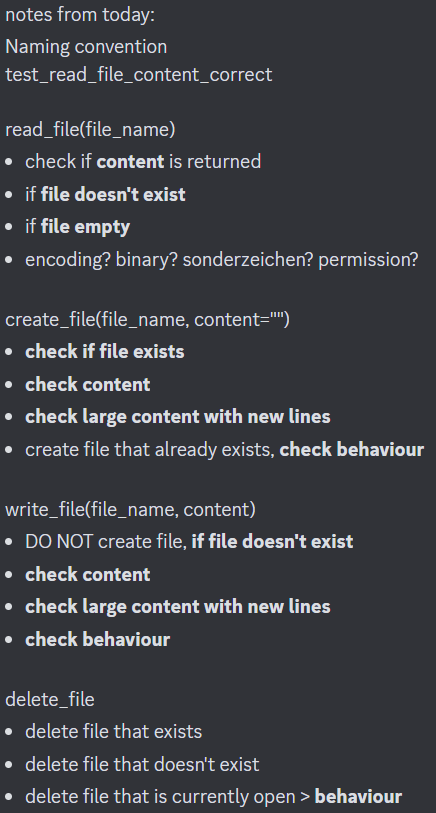
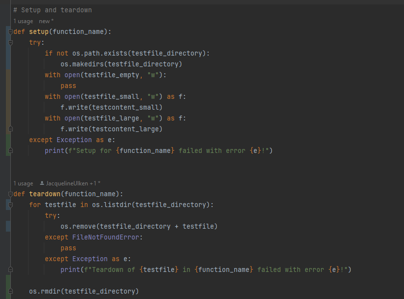

# SoCo_Assignment_01
Assignment 01 for the course Software Construction 23HS 22BI0004

## Organization
1. We decided to look and study the assignment in the first week from October 4th until October 11th and then split the
   work between the three of us.
2. To do that, we met on October 11th after the lecture and lab and discussed the assignment. We thought about some test
   ideas for each function:  We wrote down every idea that came to mind. There were some obvious ones
   such as testing if a file was created succesfully but also tests such as deleting a file that is currently open.
3. We then split the work in three parts:
    - Marc: writing teardown and setup and the dictionary, writing tests for read_file, printing and time measurement
    - Jackie: writing tests for create_file and write_file
    - Anna: writing tests for delete_file and writing README.md
   In the end, this plan was not 100% accurate and we ended up helping each other, editing each others
   parts and having meetings every now and then to work on the code together.
   We also created a discord group chat to organize, ask questions and coordinate.

## Explanation and decisions
4. We took the code from the lecture as our base and wrote the tests according to the lecture.
5. We studied the file_manager.py file first to know exactly how the functions work and what they return.
6. Most of the tests have simple style in which we assert if the expected return value is the same as the actual.
7. The reason why parameter "testcontent" appears in every test is so that all tests can be called the same way.
8. For test_delete_file_while_open we first thought about checking if a file is already opened with the .closed()
   function and then trying to delete it. We tried to implement it this way but an unresolved attribute reference came
   up. In addition, this implementation only checks if the file is closed and not if it actually can be deleted. To
   solve this, we came up with the idea to open the file and then trying to delete it, and asserting if the return
   value is "False".
<!--- insert special cases from Jackie and Marc -->
9. Setup and teardown: the following part documents our different ideas and tries
    - To test the create_file function, we need to create files. These should be deleted in the teardown function, but
      how will the teardown function find them? We had the idea to manually add them to a list or teardown just deletes
      everything without knowing what was created. We have a testfiles folder where all the testing happens and teardown
      completely deletes that folder at the end: ; 
<!--- add the other teardowns and setups -->
10. Printing and time measurement:
<!--- Marc's part -->

<!--- Format anpassen: Fliesstext und einzelne Abschnitte -->